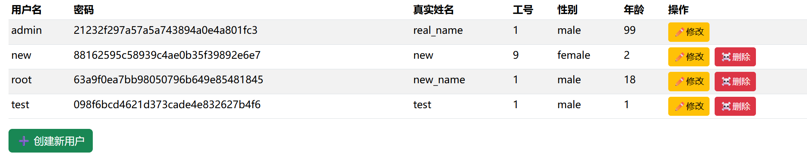
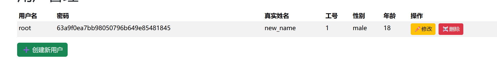
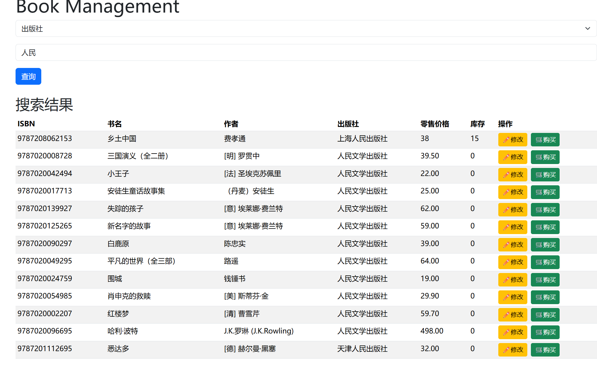
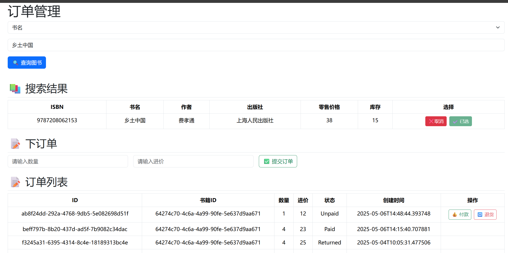
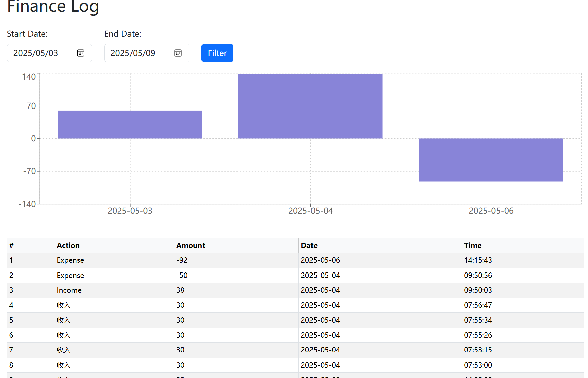

# Rotten Beans

Rotten tomatoes🍅 + DouBan Beans🫘


## Quickstart

### **Dependencies**
- rustup 1.28.1 (f9edccde0 2025-03-05)
  - `cd backend && cargo build`
- Postgresql && diesel_cli
  - Follow the [official guide of diesel](https://diesel.rs/guides/getting-started.html) to set up postgresql for the project.
- node v22.14.0
  - `cd frontend && npm install`

### Get start✨
`make dev`

Open `http://localhost:5173`

---

## 项目结构

```
RottenBeans/
├── README.md
├── backend/                # 后端 Rust + Diesel + Actix 实现
│   ├── migrations/         # 数据库迁移脚本
│   ├── src/                # 后端源代码（包括 auth、db、handlers 等模块）
│   │   ├── auth.rs
│   │   ├── bin/            # 可执行文件
│   │   ├── db/             # 数据操作代码
│   │   ├── handlers/       # actix_web处理请求的handlers  
│   │   ├── lib.rs
│   │   ├── main.rs
│   │   ├── models/         
│   │   └── schema.rs
│   └── diesel.toml
├── book_scraper/           # 图书爬虫模块，使用 Python 编写
│   ├── book_scraper/
│   └── tests/
├── frontend/               # 前端 React + TypeScript 实现
│   ├── public/
│   └── src/                # 前端源代码（组件、页面、接口等）
└── makefile                # 快捷构建命令
```

---

## 数据表的设计

### 1. users 表：用户信息管理

```sql
CREATE TABLE users (
    id SERIAL PRIMARY KEY,
    username VARCHAR(64) UNIQUE NOT NULL,
    password VARCHAR(128) NOT NULL, -- MD5
    real_name VARCHAR(64) NOT NULL,
    employee_id INTEGER NOT NULL,
    gender VARCHAR(8) NOT NULL, -- "male" or "female"
    age INTEGER NOT NULL,
    is_super BOOLEAN NOT NULL DEFAULT FALSE
);
```
- 设计目的：

  - 管理系统登录用户的信息，区分普通员工与管理员。

- 字段说明：

  - id: 自增主键，唯一标识用户。

  - username: 登录账号，唯一约束。

  - password: 加密后的密码（MD5）。

  - real_name: 真实姓名，用于展示和人事管理。

  - employee_id: 员工编号，用于关联实际工号。

  - gender / age: 基本信息统计。

  - is_super: 是否为超级管理员，用于权限控制。

### 2. books 表：图书信息管理

```sql
CREATE TABLE books (
    id UUID PRIMARY KEY,
    isbn TEXT NOT NULL,
    title TEXT NOT NULL,
    author TEXT NOT NULL,
    publisher TEXT NOT NULL,
    retail_price NUMERIC NOT NULL,
    stock INTEGER NOT NULL DEFAULT 0,
    created_at TIMESTAMP NOT NULL DEFAULT NOW()
);

```
- 设计目的：

  - 存储书籍的基本信息和库存情况。

- 字段说明：
  - id: 主键，使用 UUID 以便于外部系统对接。
  - isbn: 国际标准书号。
  - title, author, publisher: 基础书籍信息。
  - retail_price: 售价，用于前台展示与财务核算。
  - stock: 当前库存数量，便于管理入库出库。
  - created_at: 创建时间，用于追踪记录。


### 3. purchases 表：采购记录管理

```sql
CREATE TABLE purchases (
    id UUID PRIMARY KEY,
    book_id UUID REFERENCES books(id) NOT NULL,
    quantity INTEGER NOT NULL,
    purchase_price NUMERIC NOT NULL,
    status TEXT NOT NULL, -- unpaid, paid, returned
    created_at TIMESTAMP NOT NULL DEFAULT NOW()
);

```
- 设计目的：
  - 跟踪书籍采购流程，包括采购数量、单价及状态。
- 字段说明：
  - book_id: 外键关联 books 表，标识采购的书籍。
  - quantity: 采购数量。
  - purchase_price: 单本采购价格。
  - status: 当前状态（未支付、已支付、已退货），便于流程管理。
  - created_at: 记录采购时间。

### 4. finance_logs 表：财务记录

```sql

CREATE TABLE finance_logs (
    id UUID PRIMARY KEY,
    action_type TEXT NOT NULL, -- income, expense
    amount NUMERIC NOT NULL,
    created_at TIMESTAMP NOT NULL DEFAULT NOW()
);

```
- 设计目的：
  - 记录每笔与图书相关的财务收支变动。
- 字段说明：
  - action_type: 收入或支出。
  - amount: 金额。
  - created_at: 日志时间戳，用于追踪财务流。


---

## 功能实现

### 1. 用户管理模块
- 登陆与鉴权：使用 JWT 实现 token 登陆、鉴权逻辑，所有受保护路由通过 RequireAuth 组件拦截。

- Token过期处理：设置 token 有效时间为1小时，超时自动登出。`/RottenBeans/backend/src/auth.rs`

```rust
    let exp = Utc::now()
        .checked_add_signed(Duration::hours(1))
        .unwrap()
        .timestamp() as usize;
```

- 超级管理员机制：初始化系统时创建超级管理员；超级管理员可以管理所有用户，包括创建新用户、查看所有用户信息。而普通用户只能修改自己的信息。

```rust
pub struct AuthUser {
    pub username: String,
    pub is_super: bool,
}

impl FromRequest for AuthUser
```
`AuthUser`实现了`FromRequest` trait, 后端接受前端请求时可以通过检验token, 分析`is_super`来确定是否时超级管理员.




- 密码储存：使用md5加密储存。

### 2. 图书管理模块
- 图书查询：支持按照 ISBN、书名、作者、出版社等字段模糊匹配。

- 图书信息修改：管理员可对书籍的名称、作者、出版社、价格等信息进行编辑。



### 3. 图书销售模块

- 进货：系统会检测图书是否已存在，存在则更新库存，不存在则新建。

- 付款/卖出/退货：根据订单操作，自动调整库存数量，避免负库存现象。



### 4. 财务模块

- 收入与支出记录：自动记录每一次付款与售出的收支金额。

- 时间筛选：可按时间段查看指定区间的财务数据。

- 数据可视化：绘制图表，更形象直观展现书城财务数据。



### 5. 爬虫模块（book_scraper）

- 豆瓣图书信息获取：使用 Python 脚本模拟用户访问豆瓣网页，获取书籍信息；数据结果保存为 JSON 文件供后端导入。`book_scraper/book_scraper/douban_book.json`


---

### 具体功能

#### 用户管理

- [x] 登陆
- [x] 登陆后才能操作 token传递 **RequireAuth component**
- [x] token **unauthorization** time expiaration (1 hour) + sign out
- [x] 超级管理员
  - [x] 初始创建
  - [x] 创建用户
  - [x] 查看所有用户资料

#### 图书管理

- [x] 查询图书
  - [x] 书籍编号、书籍ISBN号、书名、作者、出版社 等
  - [x] 模糊查询
- [x] 图书信息修改 书籍名称、作者、出版社、零售价格

#### 图书销售

- [x] 进货
  - [x] 查询是否存在
- [x] 付款
  - [x] 更新库存
- [x] 退货
- [x] 卖出
  - [x] 更新库存

#### 财务信息

- [x] 付款、售出， 更新支出/收入
- [x] 查看某段时间的记录
- [x] 绘图

#### 书籍数据

- [x] 爬虫，添加数据

---

## 技术栈

| 模块   | 技术栈                                      |
| ---- | ---------------------------------------- |
| 前端   | React, TypeScript, Vite, Axios, Recharts, Bootstrap |
| 后端   | Rust, Actix-web, Diesel ORM, PostgreSQL  |
| 数据爬取 | Python, Requests, BeautifulSoup          |
| 鉴权机制 | JWT (Json Web Token)                     |
| 构建工具 | Makefile                                 |
| 代码风格 | Prettier                         |

